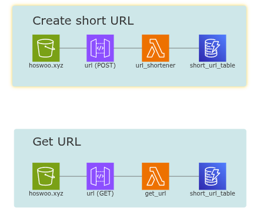

# hoswoo.xyz

This repo is the source code for my personal website, hosted on AWS.

---

####  What can you find here?

- CI/CD workflow built with bash scripts, Github Actions workflows, hopes, and dreams
- Games I have developed over the years in C++, JavaScript, and Python
- Serverless URL shortener, built with API Gateway, DynamoDB, and Lambda

#### Games

- [Shermie Invaders](https://github.com/hosua/shermie-invaders) - JavaScript
- [SDL2 Pathfinder](https://github.com/hosua/sdl2-pathfinder) - C++
- [Snake++](https://github.com/hosua/SnakePlusPlus) - C++
- [FlapyPy Bird](https://github.com/hosua/FlapPy-bird) - Python
- [TetriPy](https://github.com/hosua/TetriPy) - Python

#### URL Shortener

A simple URL shortener that allows you to generate short links with optional expiration dates.

